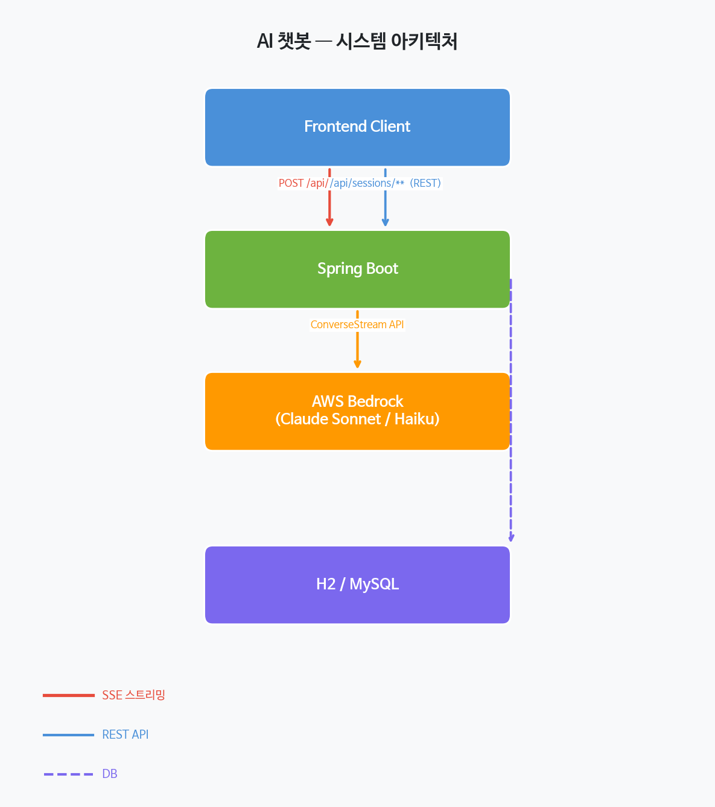

# AI 챗봇 (AWS Bedrock + Spring Boot)

AWS Bedrock의 Claude 모델을 활용한 스트리밍 AI 챗봇 백엔드 서비스입니다.  
SSE(Server-Sent Events) 기반의 실시간 스트리밍으로 자연스러운 대화 경험을 제공합니다.

---

## 기술 스택

| 레이어 | 기술 |
|--------|------|
| Backend | Java 17, Spring Boot 4.0.6 |
| AI | AWS Bedrock — Claude Sonnet 4.6 / Haiku 4.5 |
| API | Converse API (ConverseStream) |
| Streaming | Server-Sent Events (SSE) |
| DB | H2 In-Memory (개발) / MySQL (운영) |
| ORM | Spring Data JPA |
| 빌드 | Gradle, Docker (Multi-stage) |
| CI/CD | GitHub Actions → AWS ECR |

---

## 아키텍처



---

### 데이터 모델

```
sessions
┌─────────────┬──────────┬──────────┬───────────────────┬───────────────────┬──────────┐
│ id (PK)     │ userId   │ title    │ createdAt         │ updatedAt         │ metadata │
│ VARCHAR     │ VARCHAR  │ VARCHAR  │ DATETIME          │ DATETIME          │ JSON     │
└─────────────┴──────────┴──────────┴───────────────────┴───────────────────┴──────────┘

messages
┌──────────────┬─────────────┬──────────────┬─────────────────────┬───────────────────┐
│ id (PK, AUTO)│ sessionId   │ role         │ content             │ createdAt         │
│ BIGINT       │ VARCHAR(FK) │ user/asst    │ LONGTEXT            │ DATETIME          │
└──────────────┴─────────────┴──────────────┴─────────────────────┴───────────────────┘
```

---

## SSE를 선택한 이유

### WebSocket 대신 SSE를 사용한 배경

AI 챗봇의 응답 특성상 **서버 → 클라이언트** 방향의 단방향 스트리밍만 필요합니다.  
AWS Bedrock의 `ConverseStream` API는 토큰을 하나씩 생성하며 전송하기 때문에, 클라이언트가 응답 전체를 기다리지 않고 **생성되는 즉시 화면에 표시**할 수 있어야 합니다.

| 비교 항목 | SSE | WebSocket |
|----------|-----|-----------|
| 연결 방향 | 단방향 (서버 → 클라이언트) | 양방향 |
| 프로토콜 | HTTP/1.1 이상 | 별도 WS 프로토콜 |
| 자동 재연결 | 브라우저 기본 지원 | 직접 구현 필요 |
| 구현 복잡도 | 낮음 (Spring `SseEmitter`) | 높음 |
| 로드밸런서 호환 | HTTP 표준으로 우수 | Sticky Session 필요 |
| AI 스트리밍 적합성 | ✅ 최적 | 과도한 기능 |

SSE는 HTTP 표준 위에서 동작하므로 별도의 프로토콜 업그레이드나 인프라 변경 없이 기존 REST API 구조에 자연스럽게 통합됩니다.  
챗봇처럼 **요청은 단발(HTTP POST), 응답은 연속 스트림**인 패턴에서 SSE가 구조적으로 가장 적합합니다.

### Spring SseEmitter 구성

```java
// 최대 300초 대기, 8~50개 스레드 풀로 동시 스트리밍 처리
SseEmitter emitter = new SseEmitter(300_000L);
executor.execute(() -> chatService.stream(emitter, request));
return emitter;
```

---

## API 명세

### 채팅 스트리밍

```
POST /api/chat
Content-Type: application/json

{
  "sessionId": "session-uuid",
  "message": "안녕하세요!",
  "persona": "DEVELOPER"        // 선택: DEFAULT | DEVELOPER | TEACHER | WRITER
}
```

**SSE 이벤트 응답:**

| 이벤트 | 데이터 | 설명 |
|--------|--------|------|
| `text` | `{"text": "안녕"}` | 생성된 텍스트 청크 |
| `tool_start` | `{"toolUseId": "...", "toolName": "..."}` | 도구 호출 시작 |
| `done` | `{"stopReason": "end_turn", "usage": {...}}` | 응답 완료 |
| `error` | `{"message": "오류 메시지"}` | 오류 발생 |

### 세션 관리

| 메서드 | 경로 | 설명 |
|--------|------|------|
| POST | `/api/sessions` | 새 세션 생성 |
| GET | `/api/sessions?userId={id}` | 사용자 세션 목록 |
| GET | `/api/sessions/{id}` | 세션 상세 조회 |
| PUT | `/api/sessions/{id}` | 세션 수정 |
| DELETE | `/api/sessions/{id}` | 세션 삭제 |
| GET | `/api/sessions/{id}/messages` | 메시지 히스토리 조회 |
| DELETE | `/api/sessions/{id}/messages` | 메시지 히스토리 삭제 |

---

## 페르소나

| 키 | 설명 |
|----|------|
| `DEFAULT` | 기본 친절한 AI 어시스턴트 |
| `DEVELOPER` | 코드 중심 개발자 어시스턴트 |
| `TEACHER` | 개념 설명에 특화된 선생님 |
| `WRITER` | 글쓰기/문서 작성 어시스턴트 |

---

## 실행 방법

### 사전 요구사항

- Java 17+
- AWS 자격증명 설정 (`~/.aws/credentials` 또는 환경 변수)
- AWS Bedrock 모델 접근 권한 (us-east-1 리전)

### 로컬 실행

```bash
cd backend
./gradlew bootRun
```

### Docker Compose

```bash
docker-compose up -d
```

서버는 `http://localhost:3001`에서 실행됩니다.

### 환경 변수

| 변수 | 기본값 | 설명 |
|------|--------|------|
| `AWS_REGION` | `us-east-1` | AWS 리전 |
| `AWS_ACCESS_KEY_ID` | — | AWS 액세스 키 |
| `AWS_SECRET_ACCESS_KEY` | — | AWS 시크릿 키 |

---

## 프로젝트 구조

```
backend/src/main/java/com/chatbot/backend/
├── controller/
│   ├── ChatController.java        # SSE 스트리밍 엔드포인트
│   └── SessionController.java     # 세션 CRUD REST API
├── service/
│   ├── ChatService.java           # 채팅 오케스트레이션
│   ├── BedrockService.java        # AWS Bedrock 연동
│   ├── SessionManager.java        # 세션 관리
│   └── MessageHistoryService.java # 메시지 히스토리 관리
├── domain/
│   ├── Session.java               # 세션 JPA 엔티티
│   └── Message.java               # 메시지 JPA 엔티티
├── config/
│   ├── BedrockConfig.java         # AWS 클라이언트 빈
│   ├── CorsConfig.java            # CORS 설정
│   ├── Persona.java               # 페르소나 열거형
│   └── aws/                       # AWS SDK 타입 변환 레이어
├── dto/                           # 요청/응답 DTO
├── exception/                     # 커스텀 예외 & 글로벌 핸들러
└── filter/                        # 요청 로깅 필터
```

---

## CI/CD

`master` 브랜치 푸시 시 GitHub Actions가 자동으로 실행됩니다.

```
push to master
      │
      ▼
GitHub Actions
  ├── AWS OIDC 인증 (장기 자격증명 불필요)
  ├── Docker 이미지 빌드 (linux/amd64)
  └── AWS ECR 푸시 (SHA 태그 + latest)
```

---

## 구현 범위 외

다음 기능은 이번 프로젝트 범위에 포함되지 않습니다.

- 사용자 인증/인가 (로그인, 회원가입)
- 파일 업로드
- 이미지/음성 입력 (멀티모달)
- RAG (검색 증강 생성)
